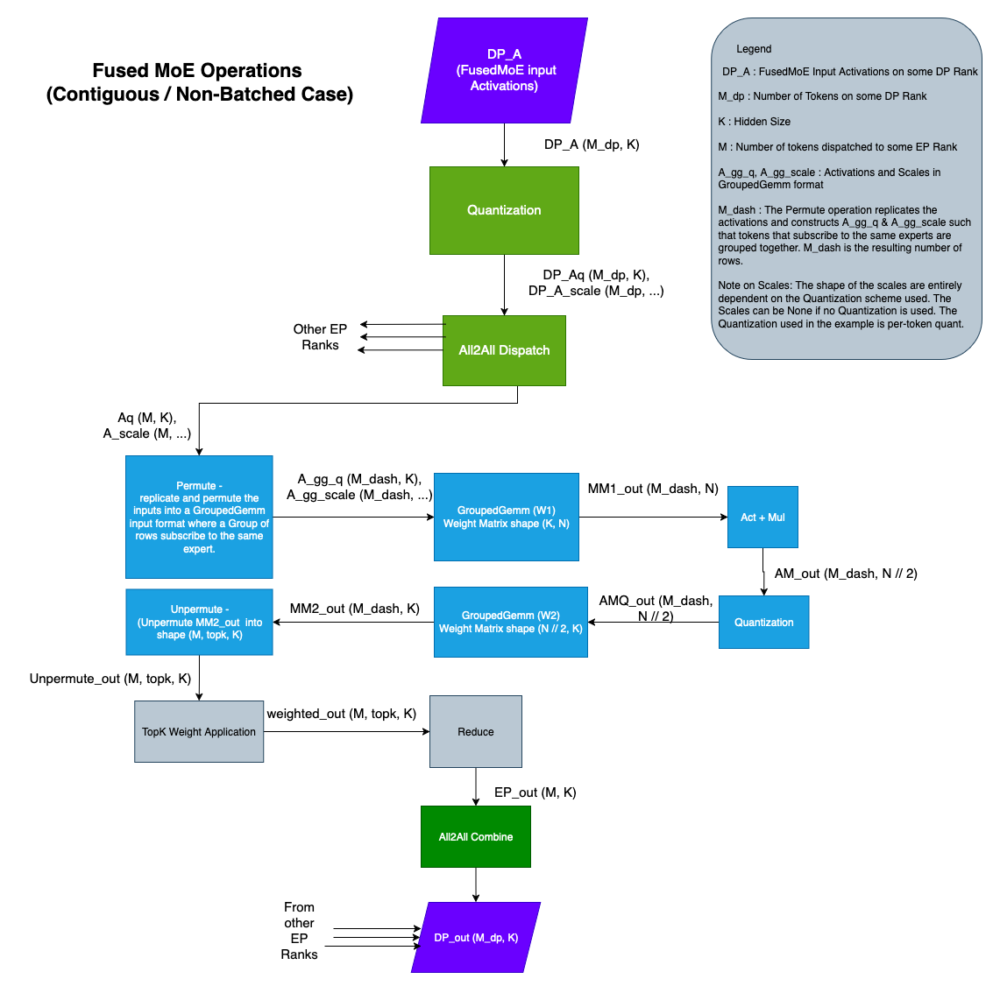
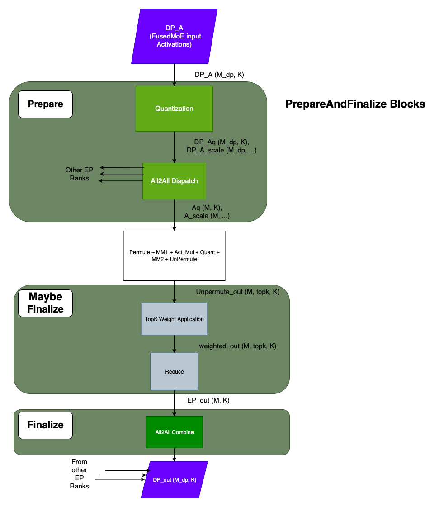

## Introduction
ModularKernel is implemented here

The FusedMoE operation is generally made of multiple operations as described in the diagrams below

> <figure markdown="span">
>   { align="center" alt="query" width="100%" }
> </figure>

> <figure markdown="span">
>   { align="center" alt="query" width="100%" }
> </figure>

Note that the main difference, in terms of operations, between the Batched and Non-Batched cases is the Permute / Unpermute operations. All other operations remain.

The ModularKernel framework groups these operations into logical components so the implementations of the FusedMoE operation is streamlined. The rest of the document focuses on the Contiguous / Non-Batched case. Extrapolating to the Batched case should be straight-forward.

## ModularKernel Components:
ModularKernel splits the FusedMoE operation into 3 parts,
    1. TopKWeightAndReduce
    2. FusedMoEPrepareAndFinalize
    3. FusedMoEPermuteExpertsUnpermute

### TopKWeightAndReduce
The TopK Weight Application and Reduction components happen right after the Unpermute operation and before the All2All Combine. Note that the `FusedMoEPermuteExpertsUnpermute` is responsible for the Unpermute and `FusedMoEPerpareAndFinalize` is responsible for the All2All Combine. There is value in doing the TopK Weight Application and Reduction in the `FusedMoEPermuteExpertsUnpermute`. But some implementations choose to do it `FusedMoEPrepareAndFinalize`. In order to enable this flexibility, we have a TopKWeightAndReduce abstract class.
Please find the implementations of TopKWeightAndReduce here.

The `FusedMoEModularKernel` acts as a bridge between the `FusedMoEPermuteExpertsUnpermute` and `FusedMoEPerpareAndFinalize` implementations to determine where the TopK Weight Application and Reduction happens.

`FusedMoEPrepareAndFinalize::finalize()` method accepts a `TopKWeightAndReduce` argument that is invoked inside the method. This is queried from the `FusedMoEPermuteAndUnpermute` implementation.

`FusedMoEPermuteAndUnpermute` returns `TopKWeightAndReduceNoOp` if the `FusedMoEPermuteAndUnpermute` implementation does the weight application and reduction itself.
`FusedMoEPermuteAndUnpermute` returns `TopKWeightAndReduceContiguous` / `TopKWeightAndReduceNaiveBatched` / `TopKWeightAndReduceDelegate` if the `FusedMoEPermuteAndUnpermute` implementation needs the `FusedMoEPrepareAndFinalize::finalize()` to do the weight application and reduction.

### FusedMoEPrepareAndFinalize
The FusedMoEPrepareAndFinalize abstract class exposes  prepare and finalize functions.
The prepare function is responsible for input activation Quantization and All2All Dispatch. The finalize function is responsible for invoking the All2All Combine. Additionally the finalize function may or may not do the TopK weight application and reduction (Please refer to the TopKWeightAndReduce section)

> <figure markdown="span">
>   { align="center" alt="query" width="100%" }
> </figure>

### FusedMoEPermuteExpertsUnpermute
The FusedMoEPermuteExpertsUnpermute class is where most of the operations happen. The FusedMoEPermuteExpertsUnpermute abstract class exposes a few important functions,
    - workspace_shapes()
    - finalize_weight_and_reduce_impl()
    - apply()

#### apply()
The `apply` method is where the implementations should perform
    - Premute
    - Matmul with weight W1
    - Act + Mul
    - Quantization
    - Matmul with weight W2
    - Unpermute
    - Maybe TopK Weight Application + Reduction

#### workspace_shapes()
The core FusedMoE implementation performs a series of operations. It would be inefficient to create output memory for each of these operations separately. To that effect, the implementations are required to provide 2 workspace shapes that could be used as intermediate buffers between operations. The `workspace_shapes()` function declares these workspace shapes that are allocated in ModularKernel::forward() and passed to the FusedMoEPermuteExpertsUnpermute::apply() function.

#### finalize_weight_and_reduce_impl()
It is sometimes efficient to perform TopK weight application and Reduction inside the FusedMoEPermuteExpertsUnpermute::apply() . An example is here . We have a `TopKWeightAndReduce` abstract class to facilitate such implementations. Please refer to the TopKWeightAndReduce section.
`FusedMoEPermuteExpertsUnpermute::finalize_weight_and_reduce_impl()` returns the `TopKWeightAndReduce` object that the implementation wants the `FusedMoEPrepareAndFinalize::finalize()` to use.

> <figure markdown="span">
>   { align="center" alt="query" width="100%" }
> </figure>

### FusedMoEModularKernel
ModularKernel is composed of the `FusedMoEPrepareAndFinalize` and `FusedMoEPermuteExpertsUnpermute` objects.
FusedMoEModularKernel pseudocode/sketch,

```
FusedMoEModularKernel::__init__(self,
prepare_finalize: FusedMoEPrepareAndFinalize,
fused_experts: FusedMoEPermuteExpertsUnpermute):
self.prepare_finalize = prepare_finalize
self.fused_experts = fused_experts

FusedMoEModularKernel::forward(self, DP_A):
    Aq, A_scale, _, _, _ = self.prepare_finalize.prepare(DP_A)
    workspace13_shape, workspace2_shape, _, _ = self.fused_experts(...)

    # allocate workspaces
    workspace_13 = torch.empty(workspace13_shape, ...)
    workspace_2 = torch.empty(workspace2_shape, ...)

    # execute fused_experts
    fe_out = self.fused_experts(Aq, A_scale, workspace13, workspace2, ...)

    # war_impl is an object of type TopKWeightAndReduceNoOp if the fused_experts implementations performs the TopK Weight Application and Reduction.
    war_impl = self.fused_experts.finalize_weight_and_reduce_impl()
    output = self.prepare_finalize.finalize(fe_out, war_impl,...)
                            
    return output
```

### FusedMoEPrepareAndFinalize Implementations
The following table lists the FusedMoEPrepareAndFinalize implementations at the time of writing,

Implementation
Type
Comments
DeepEPHTPrepareAndFinalize
Contiguous / Non-Batched
Uses the DeepEP High-Throughput all2all kernels.
DeepEPLLPrepareAndFinalize
Batched
Uses the DeepEP Low-Latency all2all kernels.
PplxPrepareAndFinalize
Batched
Uses the Perplexity all2all kernels.
FlashInferCutlassMoEPrepareAndFinalize
Contiguous

MoEPrepareAndFinalizeNoEP
Contiguous
This implementation is used when there is no EP. i.e. no all2all kernels are invoked.
BatchedPrepareAndFinalize
Batched
A reference prepare/finalize class that reorganizes the tokens into expert batched format, i.e. E x max_num_tokens x K.
(Doesn’t use any all2all kernels. This is primarily used in unit testing)

### FusedMoEPermuteExpertsUnpermute
The following table lists the FusedMoEPermuteExpertsUnpermute implementations at the time of writing,

Implementation
Type
Comment
BatchedDeepGemmExperts
Batched
Uses the DeepGemm’s Masked Grouped Gemm kernels for the fused_moe operation.
BatchedTritonExperts
Batched
Uses a Triton Kernel for the Batched matmuls.
BatchedTritonOrDeepGemmExperts
Batched
Chooses either the BatchedDeepGemmExperts or BatchedTritonExperts based on environment settings.
DeepGemmExperts
Contiguous / Non-Batched
Uses DeepGemm’s Grouped Gemm kernels for fused_moe operation.
TritonExperts
Contiguous / Non-Batched
Uses a Triton Kernel for fused_moe matmuls.
TritonOrDeepGemmExperts
Contiguous / Non-Batched
Chooses either the DeepGemmExperts or TritonExperts based on fused_moe inputs.
CutlassExpertsFP8
Supports both Batched and Contiguous formats
Uses Cutlass Grouped Gemm implementations for the fp8 matmuls..
CutlassExpertsFP4
Supports both Batched and Contiguous formats
Uses Cutlass Grouped Gemm implementations for the fp4 matmuls.
FlashInferExperts
Contiguous
Uses fused_moe operation from FlashInfer
NaiveBatchedExperts
Batched
Reference Batched Experts implementation. Primarily used in unit tests.
